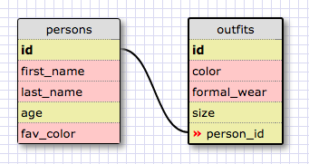

1. SELECT * FROM states;

2. SELECT * FROM regions;

3. SELECT state_name, population FROM states;

4. SELECT state_name, population FROM states ORDER BY population DESC;

5. SELECT state_name FROM states WHERE region_id = 7;

6. SELECT state_name, population_density FROM states WHERE population_density > 50 ORDER BY population_density ASC

7. SELECT state_name FROM states WHERE population BETWEEN 1000000 AND 1500000;

8. SELECT state_name, region_id FROM states ORDER BY region_id ASC;

9. SELECT region_name FROM regions WHERE region_name LIKE "%central%";

10. SELECT region_name,state_name FROM regions JOIN states ON regions.id = states.region_id;

## What are databases for?
Databases are for storing information in records which form tables.  The data
is easily accessed and modified with the use of the database, and it is more
efficient than creating very large, unwieldy objects with a program language
like Ruby or JS.

## What is a one-to-many relationship?
I like to think of this in term of sets, in a way.  I come from New England, which
is a singular, defined region.  However they are many states in that one region.
Many to one.  So, whenever you find multiple things that belong to one category, there
is a many-to-one relationship.  Or, if you look at the category first, a one-to-many
relationship.  Another example: red wine could be a category, but there are many varietals
within the scope of red wine e.g. Merlot, Pinot Noir, Carmenere, etc.

## What is a primary key? What is a foreign key? How can you determine which is which?
Each record (row) in a database needs to have a unique identifier and this is commonly
the ID, also called the primary key.  Each primary key is unique, and must be.  A foreign
key is key from another table that can be link to a field in another table.  These foreign
keys do not have to be unique.

## How can you select information out of a SQL database? What are some general guidelines for that?
The command SELECT is the starting point for accessing a table, a process also called a 'query'.
The full basic way to access all of a database is: SELECT * FROM table_name;
That would return the entire table.  From there, you can use modifiers and qualifiers to narrow
your selection or order the results of your query.  WHERE can be used to filter out data based on 
criteria within a column.