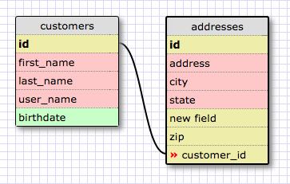
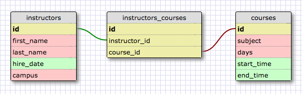
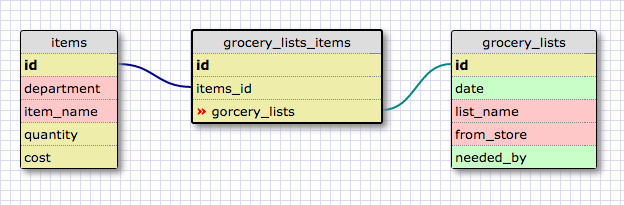

## Release 2: One to One

## Release 4: Many to Many

also

## What is a one-to-one database?
A one to one database is where two things have a single relationship to on another

## When would you use a one-to-one database? (Think generally, not in terms of the example you created).
It can be used when you need to streamline the size of various tables to improve
query performance.  For example, you might have a database of customers that includes
information such as billing address, shipping address, credit card info, and purchase
history.  You might want to split this data into separate tables so that when you are
doing a query of say, customer names, you don't need to be trolling through all of the
other data at the same time.

## What is a many-to-many database?
In a many to many database you have a multitude of items that have a specific relationship
to another item, of which there are also a great quantity.  The example I used is instructors
and courses. There are many instructors and many course, and instructors might teach more then
one course, but there might also be multiple instances of a class like "English Lit 101"

## When would you use a many-to-many database? (Think generally, not in terms of the example you created).
Whenever you have a quantity of things that relates to another large quantity of things, which is
fairly common.  The complex bit is in figuring out what the relationships are and what the join
tables should look like and include.

## What is confusing about database schemas? What makes sense?
Truly complex schemas seem exactly that - complex.  I can see it being a discipline in and of
itself to develop appropriate schemas for a database.  Figuring out what to join between two
tables and how seems a little confusing right now, but hopefully practice will make it better.